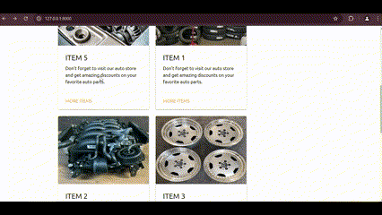
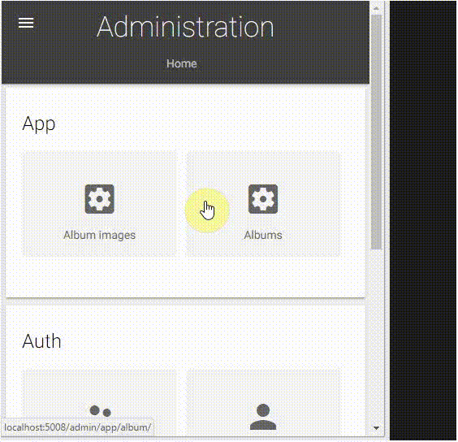

# Django photo gallery autoshop

Photo gallery for displaying auto products. Can be used as photo gallery to display products or images. 

## Summary

This sample is responsive and mobile/device friendly.

### Create an album from the Django admin panel

Albums can be created from the Django admin panel where one zip file with all the images should be selected from the PC. The Django Photo Gallery will resize the images to improve the picute load times and will also create thumbnail for every image in the zip.

## Additional Django apps dependencies
- Pillow
- django-imagekit

## Additional JavaScript apps dependencies
- jquery
- photoswipe

## Prerequisites

- Django-Python [development environment](https://www.djangoproject.com/start/) already set up.
- virtualenv installed.
- To access the admin forms go to http://127.0.0.1:8000/admin/ and enter user: admin, password: administrator
